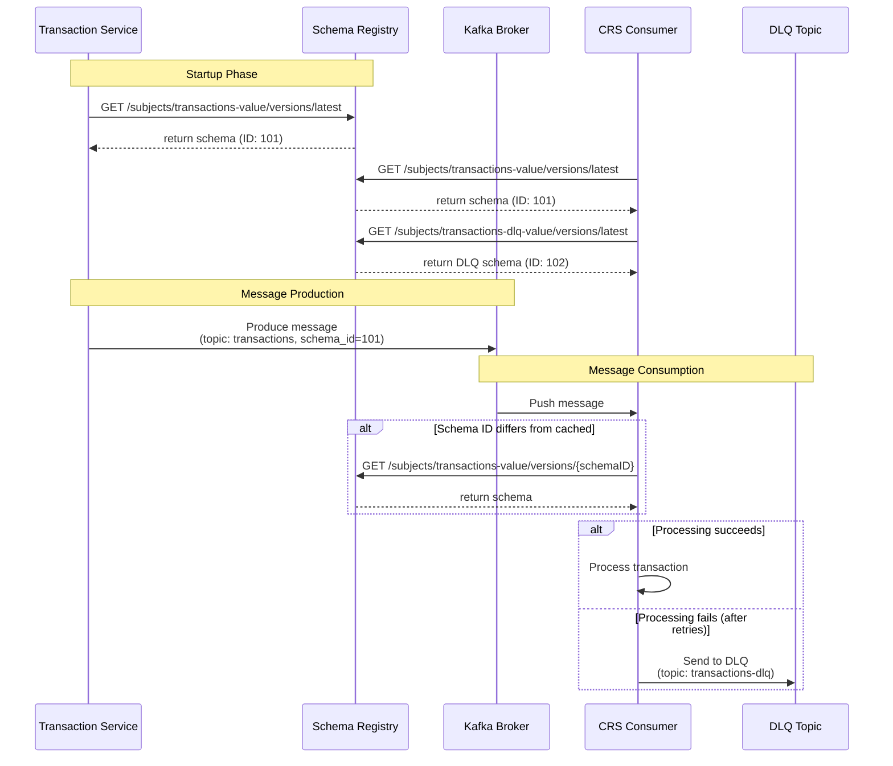

# Transaction Flow Diagram

## Key Differences from Original Diagram

1. **No HTTP endpoint**: Transaction Service generates transactions in a loop, not via POST /transactions
2. **No Transaction DB**: Transactions are generated programmatically
3. **Only CRS Consumer**: No GL or GOLD consumers exist in the codebase
4. **Topic name**: `transactions` (not `transaction-events`)
5. **Subject name**: `transactions-value` (not `transaction-event-value`)
6. **Schema fetching**: Consumer fetches schema by ID only when schema ID doesn't match cached schema
7. **DLQ handling**: Failed messages are sent to `transactions-dlq` topic using Avro format with a separate DLQ schema
8. **Startup phase**: Both producer and consumer fetch schemas during startup and cache them

